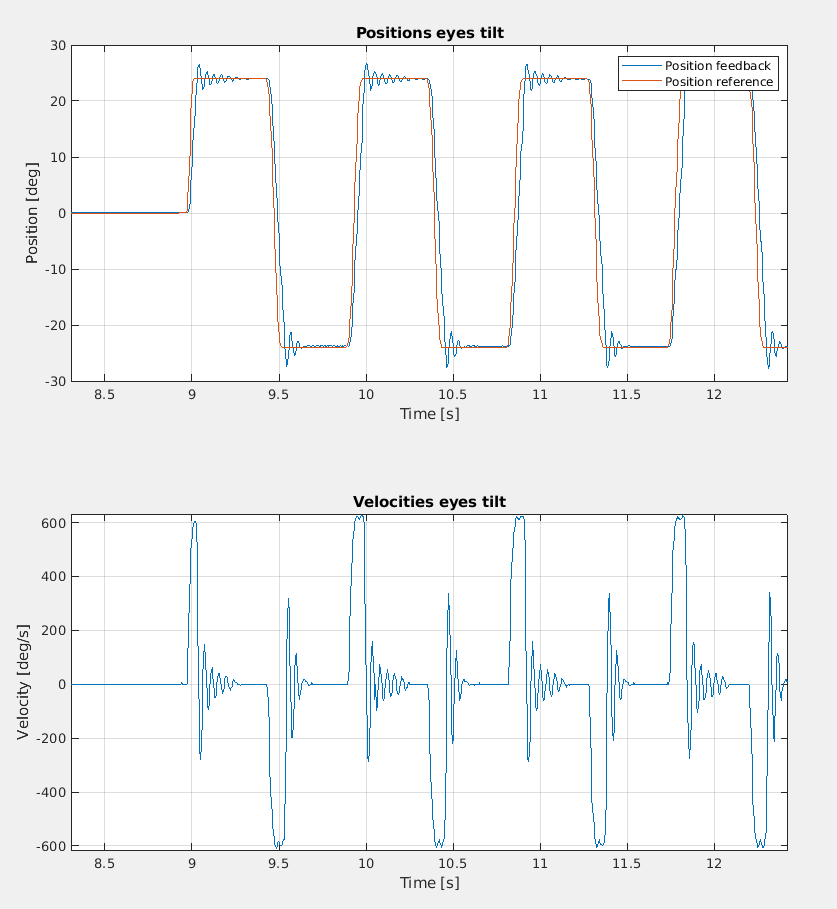

FRAMOS IMX415C - Flat cable strength
====================

The following report describes the design of the experiments that were run to mechanically test the new cameras [`FRAMOS-IMX415C`](https://www.framos.com/en/products/fsm-imx415-sensor-module-26361).

The aim of these tests was to test whether the flat cable of the new camera holds on during repeated stress movements over time.

- [FRAMOS IMX415C - Flat cable strength](#framos-imx415c---flat-cable-strength)
  - [1. Setup description](#1-setup-description)
  - [2. Tests](#2-tests)
    - [2.1 Test 1 - Constant velocity](#21-test-1---constant-velocity)
    - [2.2 Test 2 - Increasing velocity](#22-test-2---increasing-velocity)
    - [2.3 Test 3 - Mixed velocity pattern](#23-test-3---mixed-velocity-pattern)
    - [2.4 Test 4 - Mixed faster velocity pattern](#24-test-4---mixed-faster-velocity-pattern)
  - [3. Results](#3-results)
    - [3.1 Result - test 1](#31-result---test-1)
    - [3.2 Result - test 2](#32-result---test-2)
    - [3.3 Result - test 3 and test 4](#33-result---test-3-and-test-4)
  - [Conclusions](#conclusions)

## 1. Setup description

The setup consists of an old iCub head that was renewed to be usable with the new electronics. In particular, one Basler camera was substituted with the new FRAMOS-IMX415C and connected through a [flat cable](https://www.mouser.it/ProductDetail/FRAMOS/FMA-FC-150-60-V1A?qs=GedFDFLaBXGCmWApKt5QIQ%3D%3D) to the [`Boson for FRAMOS`](https://connecttech.com/product/boson-for-framos-carrier-board-for-nvidia-jetson-xavier-nx/) carrier board from ConnectTech, equipped with a [`Jetson Orin NX`](https://www.nvidia.com/it-it/autonomous-machines/embedded-systems/jetson-orin/) (see this [guide](./README.md) for reference).

  
   

To control the eyes' motors (`tilt` and `pan`), instead, an `MC4PLUS` was mounted on the top of the head:

The configuration files used to run the tests with this setup can be found [here](https://github.com/icub-tech-iit/study-icub-headedge/tree/code/head_setup).

## 2. Tests

In order to check the strength of the flat cable, different tests were conducted under different conditions. They will be illustrated in the following paragraphs. During the entire testing phase, the `argus_camera` software was kept open to continuously stream the images from the camera and check if the wiring remains plugged-in.

The tests have in common that the joints were tested one after another (usually, first `eyes_tilt`, then `eyes_pan`), sweeping throught defined velocities, awating a proper number of cycles from one another. The joints are in `position control`, so a minimum-jerk profile from the start to the end position is observed:

$$
\begin{split}
x(t) &= x_{0}+(x_{d}-x_{0})\left(10\left({t\over T}\right)^{3}-15 \left({t\over T}\right)^{4}+6\left({t\over T}\right)^{5}\right)
\end{split}
$$

For the sake of completeness, called `max` the upper mechanical limit of the joint, `min` the lower one, and `range` the difference between the maximum and the minimum, a cycle is defined as the movement that a joint performs from its zero position, going to `max - 0.1 * range`, to end up in `min + 0.1 * range`. This reasonable margin is taken into account to ensure the joint not to be damaged.

### 2.1 Test 1 - Constant velocity

The first test consisted in applying a constant reference velocity of `500 deg/s` for `500 cycles` per joint.

### 2.2 Test 2 - Increasing velocity

To stress the flat cable on the camera side, the second testing condition consisted in repeating the movement for `250 cycles`, but with an increasing velocity for each bunch of repetitions. The swept velocities were `[25, 50, 200, 500] deg/s`.

### 2.3 Test 3 - Mixed velocity pattern

This test is quite similar to the one described in the previous section, except for the velocities that, here, varied in a non-linear pattern. The sequence used in this case was `[200.0, 50.0, 100.0, 25.0, 500.0] deg/s` and, for each value, `250 cycles` were reproduced.

### 2.4 Test 4 - Mixed faster velocity pattern

The aim of the latest test was to give the maximum stress as possible to the flat cable. For this reason, the rationale behind this experiment was to move the joints more frequently, alternating between lower and higher velocity in a mixed pattern. The number of repetitions was lowered to `25 cycles` and the swept velocities were `[200.0, 50.0, 100.0, 25.0, 500.0, 150.0, 40.0, 300.0, 125.0]`.

## 3. Results

In the following paragraphs, the results of each individual test are reported in terms of position setpoints with the correspondent feedback measurements, and minjerk velocity.

The minimum-jerk peak velocity $v_{mj}^{max}$ that it will be shown in the following plots is related to the average velocity $\bar{v}$ with the following relations:
$$
\begin{split}
\bar{v} &= \frac{x_d-x_0}{T} \\
v_{mj}^{max} &= \frac{30 \left( x_d-x_0 \right)}{16 \cdot T} \approx 2 \cdot \bar{v}
\end{split}
$$

where ${T}$ is the time to complete the movement from ${x_0}$ to ${x_d}$.

### 3.1 Result - test 1

| `eyes_tilt` | `eyes_pan` |
|:--------:|:--------:|
| | |

The table above shows the position overshoot when the reference velocity set to 500 deg/s is reached. In particular, when the velocity peak is reached, the position excedeed of `~2 deg` on both tilt and pan joints. 

This behavior could be also observed during the execution of the test in the video below:

<video src="assets/tilt_camera.mp4" controls title="tilt_test"></video>

Here, some oscillations of the mechanics are detected when reaching the bounds. This justifies also the overshoot when reaching these high velocities in the next test results.

### 3.2 Result - test 2

The following plots show a zoom-in in correspondence of the transition from 200 deg/s to 500 deg/s.

| `eyes_tilt` | `eyes_pan` |
|:--------:|:--------:|
|  |  |

It can be noticed is that the `eyes_pan` has lower inertia with respect to the tilt, so maximum peaks of `~1000 deg/s` can be reached.

### 3.3 Result - test 3 and test 4

The purpose of these two tests was to give more stress to the flat cable by doing some fast movements, sweeping from high to low velocities and viceversa.

For this reason, the results in terms of acquired positions and velocities are the same of the ones reported earlier. The result that worth to be mentioned regards the flat cable that remained in place, resulting in a high strength when under quick changes of velocity.

## Conclusions

The flat cable remained plugged during the entire duration of the test, showing an high stability and durability. The tests were conducted within 4 days, for a total of about 5000 cycles per joint, including some repetitions of the described tests that were not reported in the plots since they showed the same results.
