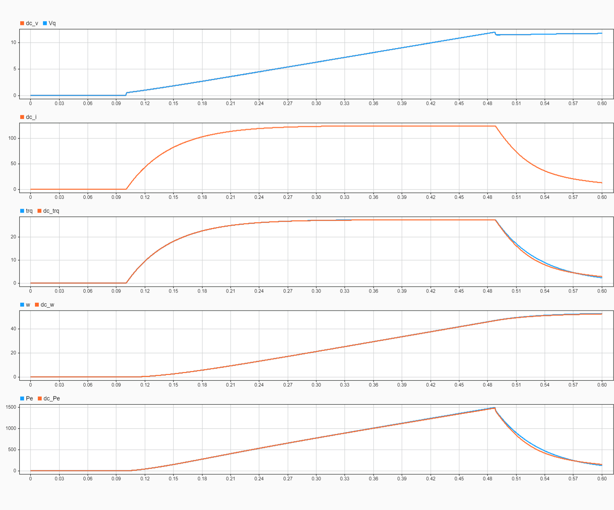

Equivalent DC model of a PMSM motor
===================================

Considering a wye-wound PMSM motor controlled via FOC (i.e., the direct current can be neglected), the equivalence with a corresponding DC motor can be enforced by imposing the following relations:
- The armature resistance of the DC model is equal to the stator resistance per phase $`R_s`$.
- The armature inductance of the DC model is equal to the stator q-axis inductance $`L_q`$.
- $`K_t^{DC} = \sqrt{\frac{3}{2}} \cdot K_t^{PMSM}`$, where $`K_t`$ is the torque constant. In particular, this relation ensures that the equivalence between the electrical power of the PMSM and the DC motor is preserved.

| Results of Speed + Current Control Equivalence  |
| :---: |
|  |
| Units: V, A, Nm, rad/s, W | 

### Resources
- [PMSM dynamic model](https://www.mathworks.com/help/releases/R2024a/sps/ref/pmsm.html)
- [Three-Phase PMSM Drive](https://www.mathworks.com/help/releases/R2024a/sps/ug/three-phase-pmsm-drive.html)
- [How to Model Brushless Electric Motors for the Design of Lightweight Robotic Systems](https://arxiv.org/abs/2310.00080)
