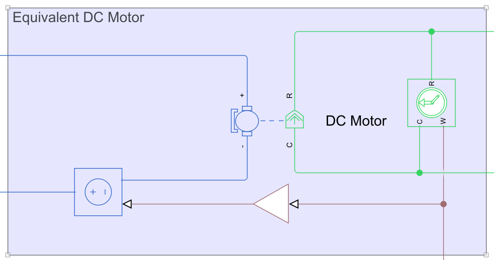

Equivalent DC model of a PMSM motor
===================================

Considering a PMSM motor controlled via FOC (i.e., the direct current can be neglected), the equivalence with a corresponding DC motor can be enforced by imposing the following relations:
- The armature resistance of the DC model is equal to $`2 \cdot R_s`$, with $`R_s`$ the stator resistance per phase.
- The armature inductance of the DC model is equal to $`2 \cdot L_q`$ with $`L_q`$ the stator q-axis inductance.
- $`K_t^{DC} = \frac{3}{2} \cdot K_t^{PMSM}`$, where $`K_t`$ is the torque constant.
- A portion of the back-emf equal to $`\frac{1}{2} \cdot K_e^{PMSM}`$ is compensated internally, where $`K_e`$ (V/rad/s) is the back-emf constant, which is equal in magnitude to $`K_t`$ (Nm/A), guaranteeing the the units are correct.

| The Equivalent DC Model |
| :---: |
|  |

| Results of Speed + Current Control Equivalence  |
| :---: |
|  |
| Units: rad/s, V, A, Nm  | 

### Resources
- [PMSM dynamic model](https://www.mathworks.com/help/releases/R2024a/sps/ref/pmsm.html)
- [Three-Phase PMSM Drive](https://www.mathworks.com/help/releases/R2024a/sps/ug/three-phase-pmsm-drive.html)
- [How to Model Brushless Electric Motors for the Design of Lightweight Robotic Systems](https://arxiv.org/abs/2310.00080)
